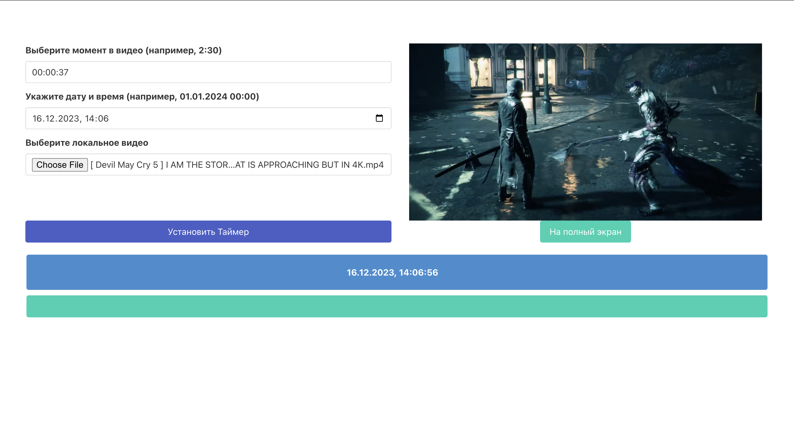

## Использование

Самый очевидный вариант использования веб-приложение - воспроизведения какого-либо момента из видео в в первые секунды нового годаю

## Описание
Этот проект представляет собой веб-приложение для синхронизации воспроизведения локального видеофайла с заданным временем. Пользователи могут выбрать момент времени в видео, указать конкретную дату и время для его начала и загрузить видеофайл. Приложение затем автоматически начнет воспроизведение видео в указанный момент.

## Инструкция по использованию

1. Откройте веб-страницу приложения.
2. Введите время в видео, когда оно должно начаться, в формате "ЧЧ:ММ:СС".
3. Укажите дату и время начала воспроизведения.
4. Загрузите локальный видеофайл.
5. Нажмите кнопку "Установить Таймер".

После этого приложение автоматически начнет воспроизведение видео в заданное время.

## Технологии
- HTML
- JavaScript
- CSS (используя фреймворк Bulma)